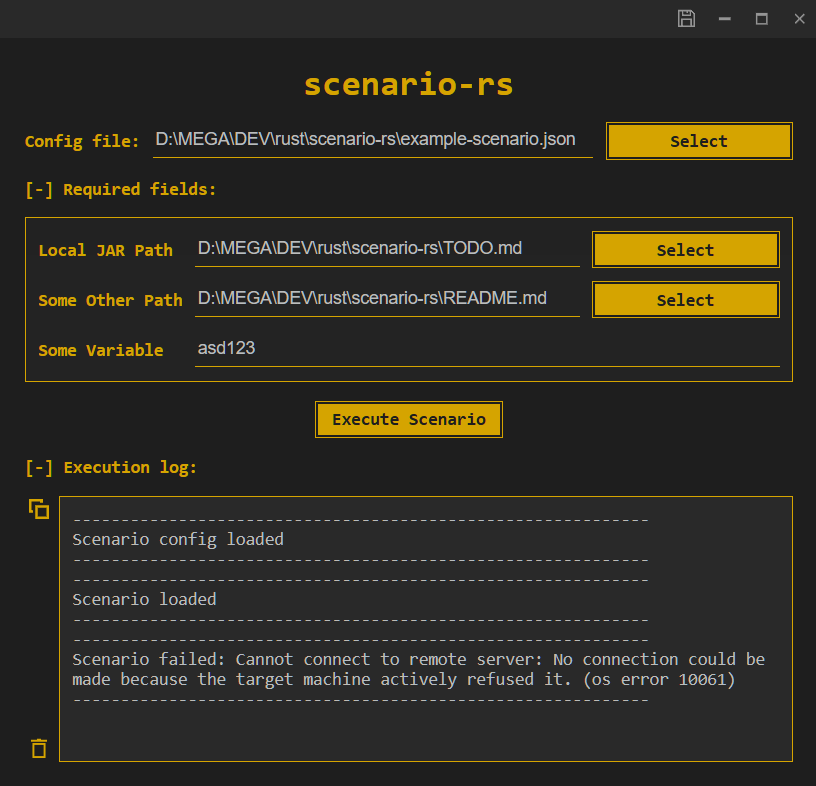

# scnario-rs

I'm too lazy to write it. I'll write it later.

Long story short, it's a CI/CD-like app for automation of remote command execution via **scenario configs**, check out [example-scenario.toml](example-scenario.toml)

- (description) ...

- (features) ...

- (usage) ...

## screenshot



## DIY

### ✨ [gui]

❗ **go to:**

```
<cloned-dir>/scenario-rs/gui/
```

### ✨ [gui.dev] 🚧

▶️ **run:**

```
npm run tauri dev
```

🛠️ **build:**

```
npm run tauri build -- --debug
```

⚡ **run executable:**

```
<cloned-dir>/scenario-rs/target/debug/scenario-rs.exe
```

### ✨ [gui.release] 🎁

🛠️ **build:**

```
npm run tauri build
```

⚡ **run executable:**

```
<cloned-dir>/scenario-rs/target/release/scenario-rs.exe
```

### 📟 [cli]

❗ **go to:**

```
<cloned-dir>/scenario-rs/cli
```

### 📟 [cli.dev] 🚧

▶️ **run:**

```
cargo run
```

🛠️ **build:**

```
cargo build
```

⚡ **run executable:**

```
<cloned-dir>/scenario-rs/target/debug/scenario-rs-cli.exe --config-path ./example-scenario.json
```

or

```
<cloned-dir>/scenario-rs/target/debug/scenario-rs-cli.exe -c ./example-scenario.json
```

### 📟 [cli.release] 🎁

🛠️ **build:**

```
cargo build --release
```

⚡ **run executable:**

```
<cloned-dir>/scenario-rs/target/release/scenario-rs-cli.exe --config-path ./example-scenario.json
```

or

```
<cloned-dir>/scenario-rs/target/release/scenario-rs-cli.exe -c ./example-scenario.json
```
