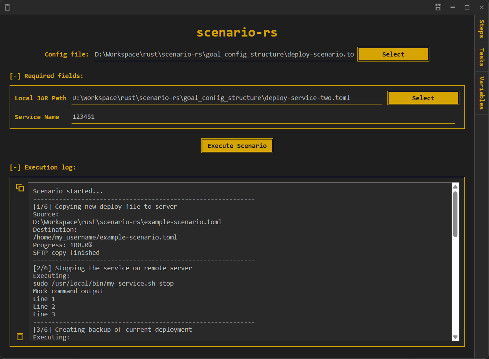
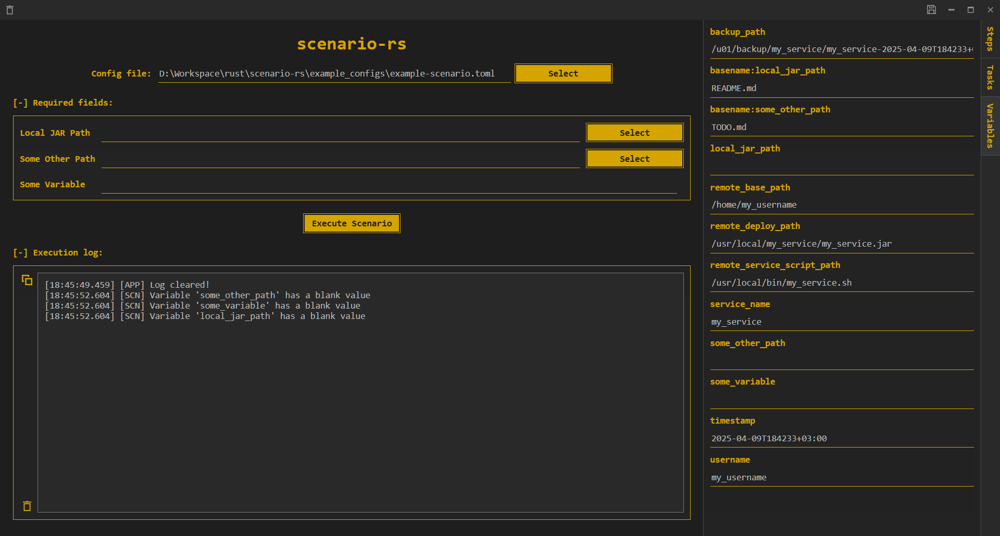
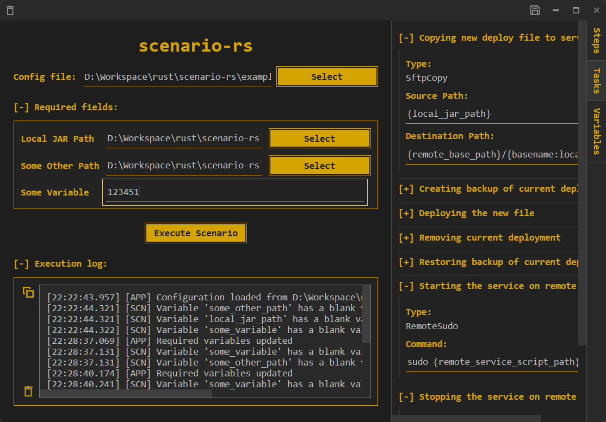
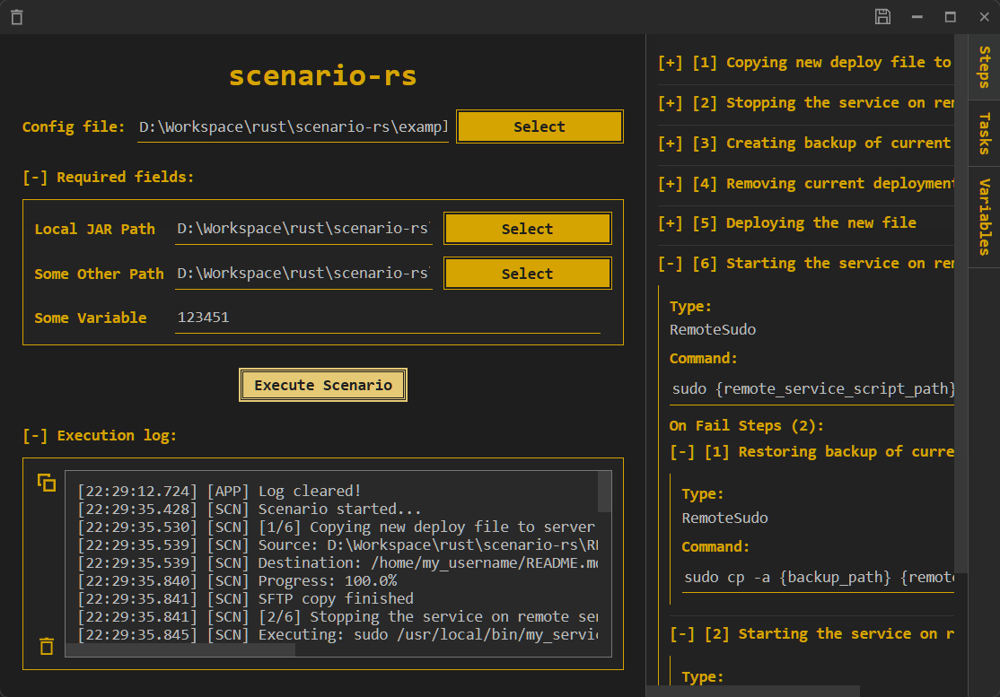

# scenario-rs

[](https://github.com/st4s1k/scenario-rs/actions/workflows/scenario-rs.yml)

A powerful automation tool for executing remote commands and transferring files via SSH. It uses configuration files to define execution scenarios, making system administration and deployment tasks repeatable and reliable.

## Features

- **Scenario Configuration**: Define your tasks in TOML files with inheritance support
- **Remote Command Execution**: Run commands on remote servers with sudo support
- **File Transfer**: Copy files to remote servers via SFTP
- **Variable Substitution**: Use variables in your commands and file paths
- **Error Recovery**: Define fallback tasks to execute when operations fail
- **Path Handling**: Special handling for file paths with automatic basename extraction
- **Progress Tracking**: Monitor execution progress with detailed feedback
- **GUI & CLI Interfaces**: Choose between a graphical interface or command-line tool

## Usage

### Configuration Files

Scenario configurations are defined in TOML files:

```toml
# Basic structure for a scenario configuration
[credentials]
username = "your-username" # will be added to the variables
password = "your-password" # optional, will use SSH agent if not provided

[server]
host = "your-server.example.com" # required
port = "22" # optional, default is 22

[execute]
# Define the execution order of tasks
steps = [
  { task = "deploy_app" },
  { task = "extract_app" },
  { task = "copy_config", on-fail = ["rollback_deployment"] }  # With error recovery
]

# Variables that must be provided by the user
[variables.required]
app_archive = { type = "Path", label = "Application Archive" }
deployment_env = { type = "String", label = "Environment" }
timestamp = { type = "Timestamp", label = "Deployment Time", format = "%Y-%m-%dT%H%M%S%:z", read_only = true }

# Define variables to be used in commands and file paths
[variables.defined]
app_name = "myapp"
app_version = "1.0.0"
remote_app_path = "/opt/{app_name}"

# Define tasks that can be referenced in execution steps
[tasks.deploy_app]
type = "RemoteSudo"
description = "Deploy application"
command = "mkdir -p {remote_app_path} && cp /tmp/{basename:app_archive} {remote_app_path}/"
error_message = "Failed to deploy application"

[tasks.extract_app]
type = "RemoteSudo"
description = "Extract application archive"
command = "tar -xzf {remote_app_path}/{basename:app_archive} -C {remote_app_path}"
error_message = "Failed to extract application"

[tasks.copy_config]
type = "SftpCopy"
description = "Copy configuration file"
source_path = "config/{deployment_env}.conf"
destination_path = "{remote_app_path}/config.conf"
error_message = "Failed to copy configuration"

[tasks.rollback_deployment]
type = "RemoteSudo"
description = "Rollback failed deployment"
command = "rm -rf {remote_app_path}/*"
error_message = "Failed to rollback deployment"
```

### Variable Types

The application supports different variable types:

- **String**: Regular text input
- **Path**: File path with special handling (automatically extracts basename)
- **Timestamp**: Automatically generated timestamp with specified format

### Inheritance

You can split your configuration across multiple files and use inheritance:

#### Parent file (base.toml)
```toml
[credentials]
username = "default-user"

[server]
host = "default-host"
port = "22"

[variables.required]
timestamp = { type = "Timestamp", label = "Deployment Time", format = "%Y-%m-%d", read_only = true }

[variables.defined]
app_name = "default-app"
```

#### Child file (specific.toml)
```toml
parent = "base.toml"  # Will inherit and override from parent

[credentials]
username = "specific-user"

[variables.required]
env_name = { type = "String", label = "Environment Name" }

[variables.defined]
app_version = "1.0.0"  # Adds new variable while keeping app_name from parent
```

## GUI

The GUI provides a modern Tauri-based interface for managing and executing scenarios:

### Features

- **Configuration Management**: Load, validate, and execute scenario configurations
- **Variable Management**: Set and update required variables with type-specific controls
- **Real-time Execution**: Monitor scenario execution with step-by-step progress
- **State Persistence**: Save and restore application state between sessions
- **Task & Step Visualization**: Visual representation of scenario tasks and steps
- **Detailed Logging**: View detailed execution logs with filtering options
- **Variable Resolution**: See how variables are resolved during execution

### Interface Components

- **Configuration Loader**: Open dialog for selecting TOML configuration files
- **Variable Editor**: Type-appropriate input fields for required variables
- **Execution Panel**: Control execution and view real-time progress
- **Log Viewer**: Structured view of execution events and messages
- **Task Explorer**: Hierarchical view of tasks and their relationships
- **Variables Inspector**: View all defined and resolved variables

## CLI

For automation scripts or CI/CD pipelines, use the command-line interface:

```
scenario-rs-cli --config-path <path-to-config.toml> [options]
```

### Command Line Arguments:

```
Usage: scenario-rs-cli [OPTIONS] --config-path <TOML_FILE>

Options:
  -c, --config-path <TOML_FILE>                Path to the TOML file containing the scenario configuration
  -l, --log-level <LOG_LEVEL>                  Log level for the application [default: INFO]
  -r, --required-variables <REQUIRED_VARIABLES>  Required variables in the format KEY=VALUE
  -h, --help                                   Print help
  -V, --version                                Print version
```

#### Examples

Basic execution:
```
scenario-rs-cli -c ./example_configs/example-scenario.toml
```

With required variables:
```
scenario-rs-cli -c ./example_configs/deploy-scenario.toml -r app_version=1.2.3 -r env=production
```

With custom log level:
```
scenario-rs-cli -c ./example_configs/example-scenario.toml -l debug
```

## Screenshots



<details>
  <summary><b>❗click here to view more screenshots❗<b></summary>

  

  

  

</details>

## DIY

### ✨ [gui]

❗ **go to:**

```
<cloned-dir>/scenario-rs/gui/
```

### ✨ [gui.dev] 🚧

▶️ **run:**

```
npm run tauri dev
```

🛠️ **build:**

```
npm run tauri build -- --debug
```

⚡ **run executable:**

```
<cloned-dir>/scenario-rs/target/debug/scenario-rs.exe
```

### ✨ [gui.release] 🎁

🛠️ **build:**

```
npm run tauri build
```

⚡ **run executable:**

```
<cloned-dir>/scenario-rs/target/release/scenario-rs.exe
```

### 📟 [cli]

❗ **go to:**

```
<cloned-dir>/scenario-rs/cli
```

### 📟 [cli.dev] 🚧

▶️ **run:**

```
cargo run -- -c ./example_configs/example-scenario.toml
```

🛠️ **build:**

```
cargo build
```

⚡ **run executable:**

```
<cloned-dir>/scenario-rs/target/debug/scenario-rs-cli.exe --config-path ./example_configs/example-scenario.toml
```

or

```
<cloned-dir>/scenario-rs/target/debug/scenario-rs-cli.exe -c ./example_configs/example-scenario.toml
```

### 📟 [cli.release] 🎁

🛠️ **build:**

```
cargo build --release
```

⚡ **run executable:**

```
<cloned-dir>/scenario-rs/target/release/scenario-rs-cli.exe --config-path ./example_configs/example-scenario.toml
```

or

```
<cloned-dir>/scenario-rs/target/release/scenario-rs-cli.exe -c ./example_configs/example-scenario.toml
```
