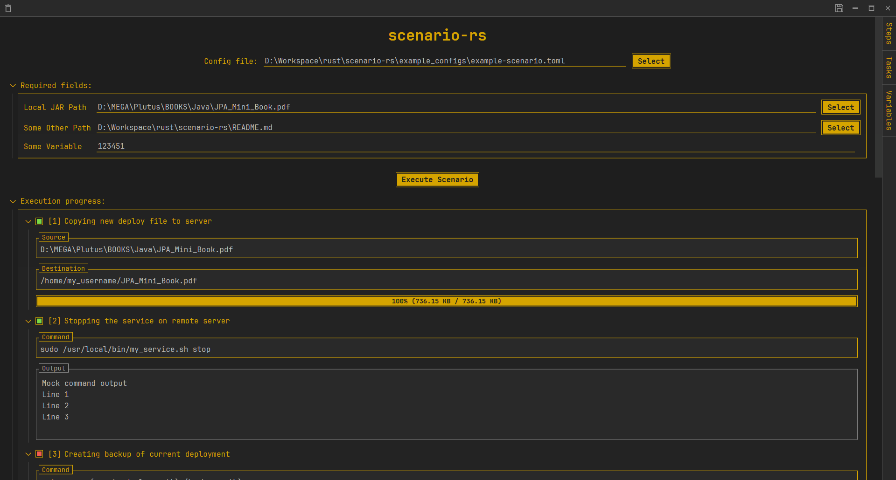
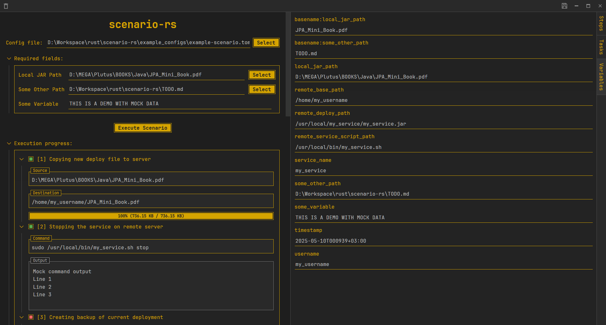
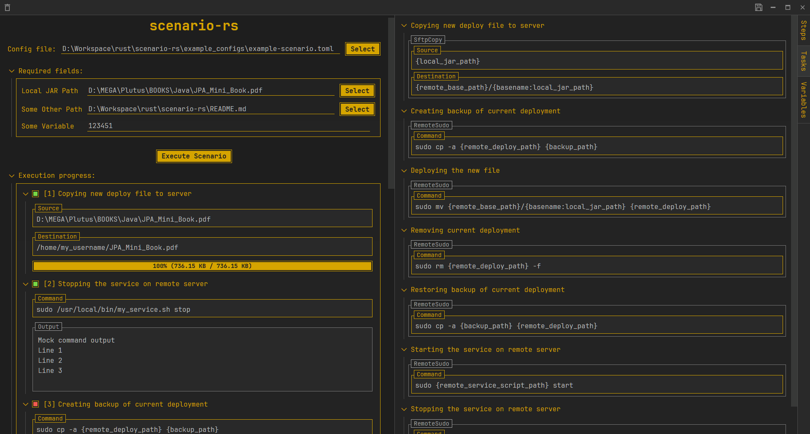
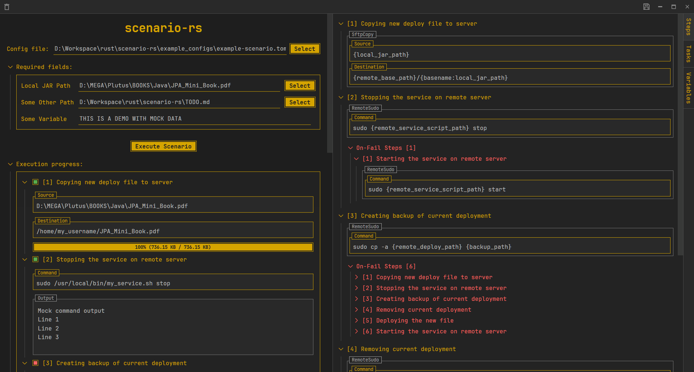
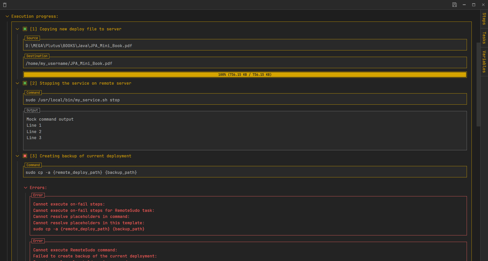
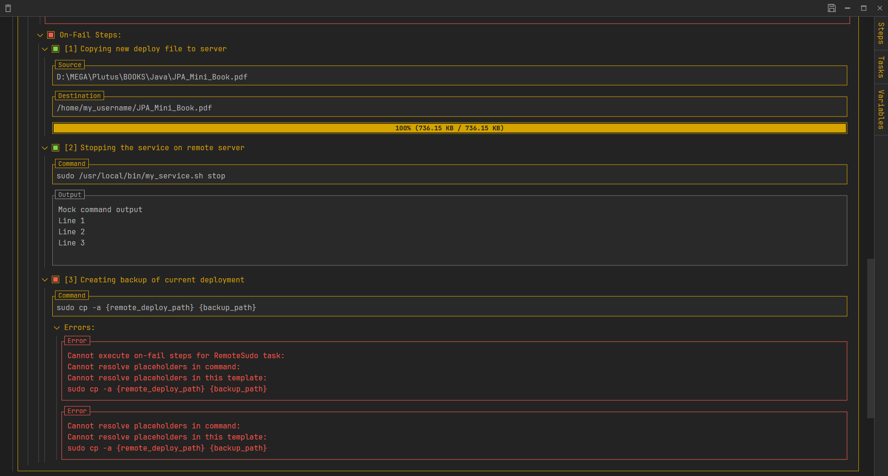

# scenario-rs

[](https://opensource.org/licenses/MIT) or [](https://opensource.org/licenses/Apache-2.0)

<table>
<tr><td>Publish</td><td><a href="https://github.com/st4s1k/scenario-rs/actions/workflows/scenario-rs.yml"></a></td></tr>
<tr><td>Rust Coverage</td><td><a href="https://codecov.io/gh/st4s1k/scenario-rs"></a></td></tr>
<tr><td>Angular Coverage</td><td><a href="https://codecov.io/gh/st4s1k/scenario-rs"></a></td></tr>
</table>

A powerful automation tool for executing remote commands and transferring files via SSH. It uses configuration files to define execution scenarios, making system administration and deployment tasks repeatable and reliable.

## Features

- **Scenario Configuration**: Define your tasks in TOML files with inheritance support
- **Remote Command Execution**: Run commands on remote servers with sudo support
- **File Transfer**: Copy files to remote servers via SFTP
- **Variable Substitution**: Use variables in your commands and file paths, including `{env:VAR}` for environment variables
- **Error Recovery**: Define fallback tasks to execute when operations fail
- **Path Handling**: Special handling for file paths with automatic basename extraction
- **Progress Tracking**: Monitor execution progress with detailed feedback
- **JSON Schema Validation**: Included schema file for TOML editor validation and autocompletion
- **GUI, TUI & CLI Interfaces**: Choose between a graphical interface, terminal UI, or command-line tool

## Usage

### Configuration Files

Scenario configurations are defined in TOML files:

```toml
# Basic structure for a scenario configuration
[credentials]
username = "your-username" # will be added to the variables
password = "your-password" # optional, will use SSH agent if not provided

[server]
host = "your-server.example.com" # required
port = 22 # optional, default is 22

# Define the execution order of steps (order is preserved)
[steps.deploy_app]
task = "deploy_app"

[steps.extract_app]
task = "extract_app"

[steps.copy_config]
task = "copy_config"
on-fail = "rollback_steps"  # Reference to a sequence for error recovery

# Define reusable sequences of tasks
[sequences]
rollback_steps = ["rollback_deployment"]

# Variables that must be provided by the user
[variables.required]
app_archive = { type = "Path", label = "Application Archive" }
deployment_env = { type = "String", label = "Environment" }
timestamp = { type = "Timestamp", label = "Deployment Time", format = "%Y-%m-%dT%H%M%S%:z", read_only = true }

# Define variables to be used in commands and file paths
[variables.defined]
app_name = "myapp"
app_version = "1.0.0"
remote_app_path = "/opt/{app_name}"

# Define remote sudo tasks
[tasks.remote_sudo.deploy_app]
command = "mkdir -p {remote_app_path} && cp /tmp/{basename:app_archive} {remote_app_path}/"
description = "Deploy application"
error_message = "Failed to deploy application"

[tasks.remote_sudo.extract_app]
command = "tar -xzf {remote_app_path}/{basename:app_archive} -C {remote_app_path}"
description = "Extract application archive"
error_message = "Failed to extract application"

[tasks.remote_sudo.rollback_deployment]
command = "rm -rf {remote_app_path}/*"
description = "Rollback failed deployment"
error_message = "Failed to rollback deployment"

# Define SFTP copy tasks
[tasks.sftp_copy.copy_config]
source = "config/{deployment_env}.conf"
destination = "{remote_app_path}/config.conf"
description = "Copy configuration file"
error_message = "Failed to copy configuration"
```

### Variable Types

The application supports different variable types:

- **String**: Regular text input
- **Path**: File path with special handling (automatically extracts basename)
- **Timestamp**: Automatically generated timestamp with specified format

### Placeholder Syntax

Variables are referenced in commands and paths using `{variable_name}` placeholders. Two special modifiers are supported:

- **`{basename:path_var}`** — Extracts the filename from a Path variable (e.g., `/home/user/app.jar` → `app.jar`)
- **`{env:VAR_NAME}`** — Resolves to the value of an environment variable at runtime (errors if not set)

```toml
[variables.defined]
remote_backup_path = "/backup/{service_name}/{service_name}-{timestamp}.{env:USER}.jar"
```

### Inheritance

You can split your configuration across multiple files and use inheritance:

#### Parent file (base.toml)
```toml
[credentials]
username = "default-user"

[server]
host = "default-host"
port = 22

[variables.required]
timestamp = { type = "Timestamp", label = "Deployment Time", format = "%Y-%m-%d", read_only = true }

[variables.defined]
app_name = "default-app"

[steps.deploy]
task = "deploy"

[tasks.remote_sudo.deploy]
command = "echo deploying {app_name}"
```

#### Child file (specific.toml)
```toml
parent = "base.toml"  # Will inherit and override from parent

[credentials]
username = "specific-user"

[variables.required]
env_name = { type = "String", label = "Environment Name" }

[variables.defined]
app_version = "1.0.0"  # Adds new variable while keeping app_name from parent
```

### JSON Schema Validation

A JSON Schema file (`scenario-schema.json`) is included at the repository root, generated from the Rust config types. Add a `#:schema` directive as the first line of your TOML files to enable editor validation and autocompletion (supported by [Even Better TOML](https://marketplace.visualstudio.com/items?itemName=tamasfe.even-better-toml) and [taplo](https://taplo.tamasfe.dev/)):

```toml
#:schema ../scenario-schema.json

[credentials]
username = "my-user"
# ...
```

Regenerate the schema after config type changes with:

```
just schema > scenario-schema.json
```

## GUI

The GUI provides a modern Tauri-based interface for managing and executing scenarios:

### Features

- **Configuration Management**: Load, validate, and execute scenario configurations
- **Variable Management**: Set and update required variables with type-specific controls
- **Real-time Execution**: Monitor scenario execution with step-by-step progress
- **State Persistence**: Save and restore application state between sessions
- **Task & Step Visualization**: Visual representation of scenario tasks and steps
- **Detailed Logging**: View detailed execution logs with filtering options
- **Variable Resolution**: See how variables are resolved during execution

### Interface Components

- **Configuration Loader**: Open dialog for selecting TOML configuration files
- **Variable Editor**: Type-appropriate input fields for required variables
- **Execution Panel**: Control execution and view real-time progress
- **Log Viewer**: Structured view of execution events and messages
- **Task Explorer**: Hierarchical view of tasks and their relationships
- **Variables Inspector**: View all defined and resolved variables

## TUI

The TUI provides an interactive terminal interface for selecting configs, filling in variables, and monitoring execution — no desktop environment required.

```
scenario-rs-tui [--config-path <path-to-config.toml>]
```

### Features

- **File Browser**: Browse and select TOML configuration files interactively
- **Variable Form**: Fill in required variables with type-aware input (includes file picker for Path variables)
- **Live Execution View**: Monitor step-by-step progress with output and error details
- **Keyboard-Driven**: Fully navigable with keyboard shortcuts

### Keyboard Shortcuts

| Screen | Key | Action |
|---|---|---|
| File Browser | `↑/↓` | Navigate entries |
| File Browser | `Enter` | Open directory / confirm file |
| File Browser | `Backspace` | Go to parent directory |
| File Browser | `Esc` | Cancel |
| Variables | `Tab/↑/↓` | Navigate fields |
| Variables | `Ctrl+B` | Open file picker (Path fields) |
| Variables | `Ctrl+D` | Toggle debug mode |
| Variables | `Enter` | Start execution |
| Variables | `Esc` | Quit |
| Executing | `↑/↓` | Select step |
| Executing | `PgUp/PgDn` | Scroll output |
| Done | `q/Esc` | Quit |
| Done | `r` | Re-run same scenario |
| Done | `n` | Pick new scenario |

## CLI

For automation scripts or CI/CD pipelines, use the command-line interface:

```
scenario-rs-cli --config-path <path-to-config.toml> [options]
```

### Command Line Arguments:

```
Usage: scenario-rs-cli [OPTIONS] --config-path <TOML_FILE>

Options:
  -c, --config-path <TOML_FILE>                Path to the TOML file containing the scenario configuration
  -l, --log-level <LOG_LEVEL>                  Log level for the application [default: INFO]
  -r, --required-variables <REQUIRED_VARIABLES>  Required variables in the format KEY=VALUE
  -h, --help                                   Print help
  -V, --version                                Print version
```

#### Examples

Basic execution:
```
scenario-rs-cli -c ./example_configs/example-scenario.toml
```

With required variables:
```
scenario-rs-cli -c ./example_configs/deploy-scenario.toml -r app_version=1.2.3 -r env=production
```

With custom log level:
```
scenario-rs-cli -c ./example_configs/example-scenario.toml -l debug
```

## GUI Demo

[](https://github.com/user-attachments/assets/035dcca9-293b-41ea-a6ec-bfb94d922e63)

## Screenshots



<details>
  <summary><b>❗click here to view more screenshots❗<b></summary>

  <h2>Variables</h2>

  

  <h2>Tasks</h2>

  

  <h2>Steps</h2>

  

  <h2>Execution progress</h2>

  

  

</details>

## Build with just

All build tasks can be run from the project root using [just](https://github.com/casey/just).

### Setup

```
cargo install just
```

### Available Recipes

Run `just` to list all available recipes.

#### Run

| Command | Description |
|---|---|
| `just cli` | Run CLI in development mode |
| `just tui` | Run TUI in development mode |
| `just gui` | Run GUI in development mode |

#### Build

| Command | Description |
|---|---|
| `just check` | Run `cargo check` on the workspace |
| `just build` | Build the workspace (debug) |
| `just build-release` | Build the workspace (release) |
| `just tui-build` | Build TUI (release) |
| `just tauri-build-debug` | Build GUI (debug) |
| `just tauri-build` | Build GUI (release) |
| `just build-all` | Build everything (Rust + GUI debug) |
| `just build-all-release` | Build everything (Rust + GUI release) |

#### Test

| Command | Description |
|---|---|
| `just test` | Run Rust tests with coverage (requires [cargo-tarpaulin](https://github.com/xd009642/tarpaulin)) |
| `just ng-test` | Run Angular unit tests with coverage |
| `just test-all` | Run all tests with coverage (Rust + Angular) |
| `just verify` | Full verification: check + all tests + Angular build |

#### Frontend

| Command | Description |
|---|---|
| `just npm-install` | Install frontend dependencies |
| `just ng-build` | Build Angular frontend |

#### General

| Command | Description |
|---|---|
| `just version` | Show current version |
| `just bump-version x.y.z` | Set version across all packages |
| `just schema` | Generate JSON Schema for scenario config |
